# Todo App — Next.js 16 + Docker + Azure

Application de gestion de tâches (todo list) construite avec Next.js 16, dockerisée et déployée sur Azure.

---

## Fonctionnalités

- Ajouter une tâche
- Afficher les tâches
- Modifier l'état d'une tâche (terminée / non terminée)
- Supprimer une tâche

---

## Stack technique

- **Frontend / Backend** : Next.js 16 (App Router, Server Actions)
- **Persistance locale** : fichier JSON (`data/todos.json`)
- **Conteneurisation** : Docker (multi-stage build, mode standalone)
- **Registre d'images** : Azure Container Registry
- **Déploiement** : Azure Container Instances

---

## Structure du projet

```
app/
├── page.tsx              # Page principale (Server Component)
├── layout.tsx            # Layout racine
├── actions.ts            # Server Actions (add / toggle / delete)
├── globals.css           # Styles CSS
├── api/route.ts          # Route API hello world
├── lib/todos.ts          # Store de données (lecture/écriture JSON)
└── components/
    ├── AddTodoForm.tsx   # Formulaire d'ajout (Client Component)
    └── TodoItem.tsx      # Ligne de tâche (Client Component)
```

---

## 1. Développement local

### Lancer en mode développement

```bash
pnpm install
pnpm dev
```

Application accessible sur `http://localhost:3000`

---

## 2. Docker en local

pour lancer docker en local il faut après avoir créer le Dockerfile, lancer deux commmande. La première pour créer l'image, et la deuxième pour lancer le conteneur de celle-ci

### Construire l'image

d'abord il faut entrer cette commande

```bash
docker build -t todo-app .
```
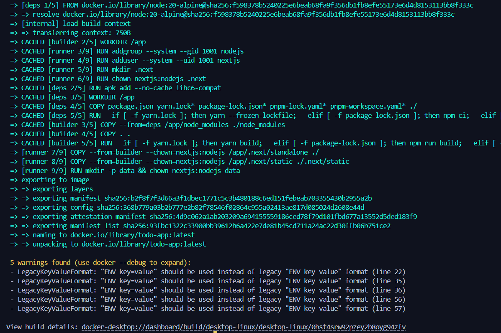

cela permet de créer l'image avec comme nom **"todo-app"**

### Lancer le conteneur

ensuite la prochaine commande permet de créer le container

```bash
docker run -p 3000:3000 todo-app
```
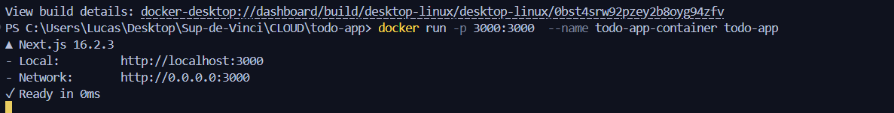

Une fois lancé, on y accéder a partire de `http://localhost:3000`

---

## 3. Azure Container Registry (ACR)

le container registry d'azur va nous permettre de récupérer l'image qu'on a crée juste avant (**'todo-app'**) pour pouvoir ensuite l'utilise sur azure avec l'instance de conteneurs 
### Créer le registre

d'abord il faut créer un groupe de ressource pour y mettre tout les éléments futures ensemble. Cela permet de les rassembler et si on venait a les supprimer de ne pas a avoir a le faire un par un.

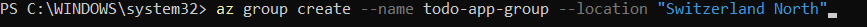

une fois le groupe de ressources créer on peut ensuite créer le container registry avec la commande ci-dessous.

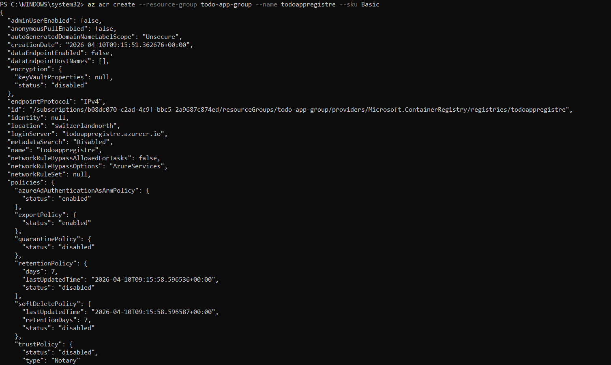

### Se connecter et pousser l'image

Une fois le container registry créer, on va pouvoir pousser notre image docker dans celui-ci. 

Pour cela il faut d'abord se login au container avec cette commande

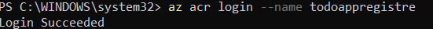

après on peut uiliser docker pour d'abord build l'image de todo-app (attention a mettre le **.azurecr.io**, pour ne pas avoir d'erreur lors du build)

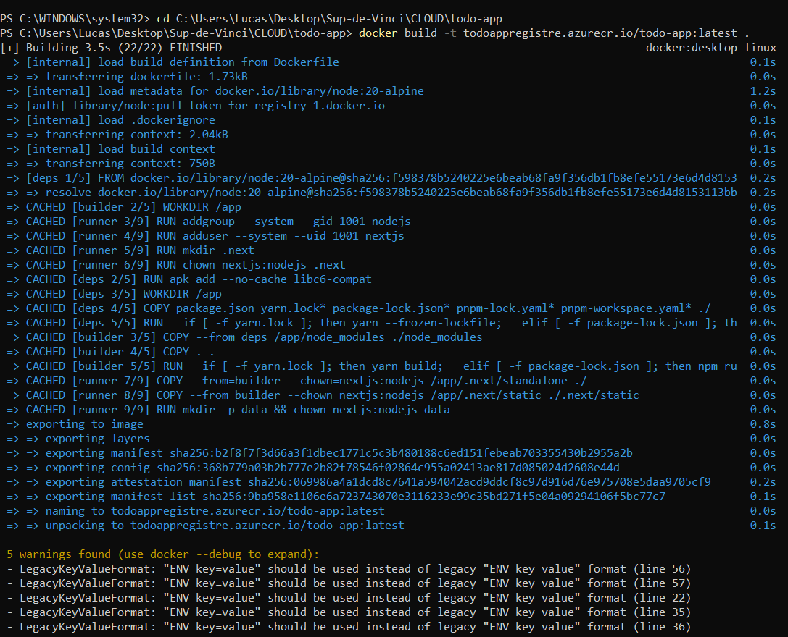

Une fois le build fini, il suffit juste de push l'image dans le container registre 

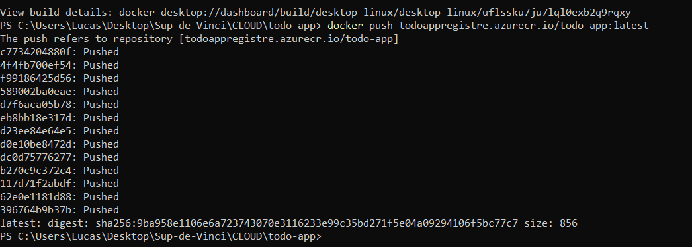


### Vérifier que l'image est bien dans ACR
une fois sur azure, on peut avoir que le groupe et le container registry ont bien été crée (il peuvent prendre du temp a apparaitre). Ce qui nous assure que toutes les commandes faites au paravant on bien fonctionné

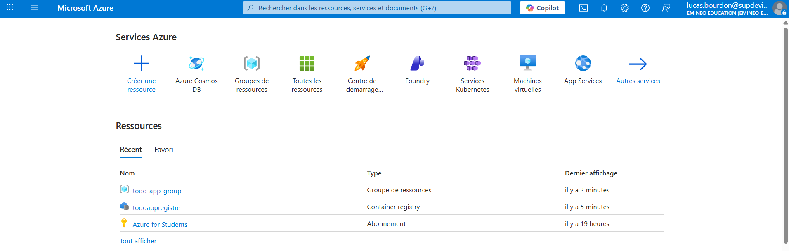
---

## 4. Azure Container Instances (ACI)

Maintenant que nous avons notre container registry, on peut créer un instance de conteneur qui permettra de créer l'accès a notre image docker grace a un url publique 

### Créer l'instance de conteneur

Il suffit simplement de remplir les éléments obligatoires

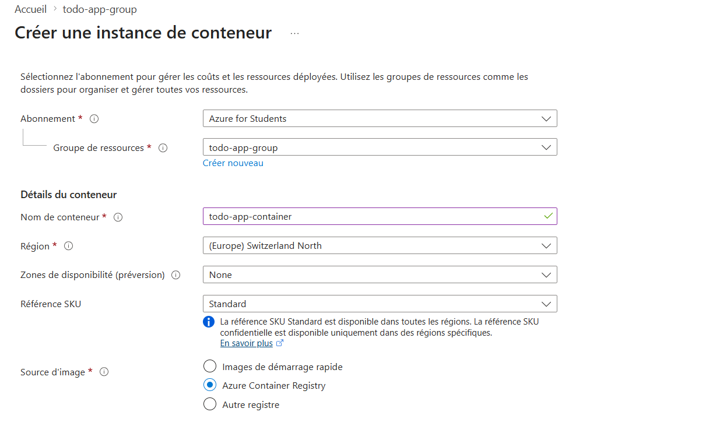

cependant j'ai eu cette erreur car mon groupe de ressources n'avait pas les droit administrateurs

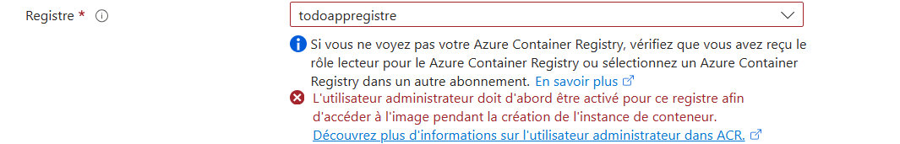

### Activer l'utilisateur admin

il a donc fallu activer l'administrateur pour le registre

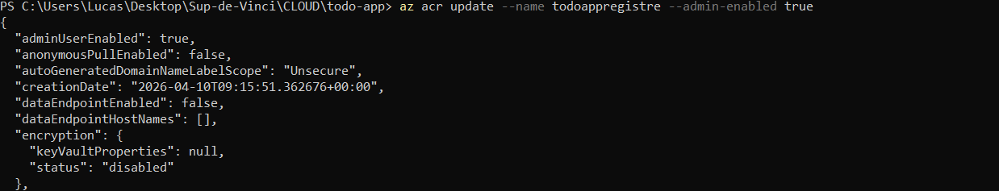


### Continuation de la création de l'instance de conteneur
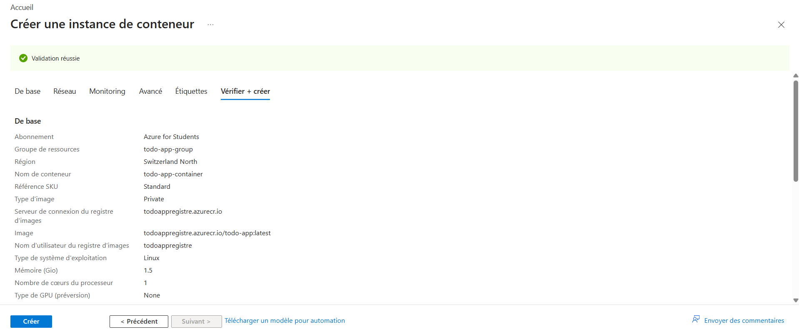

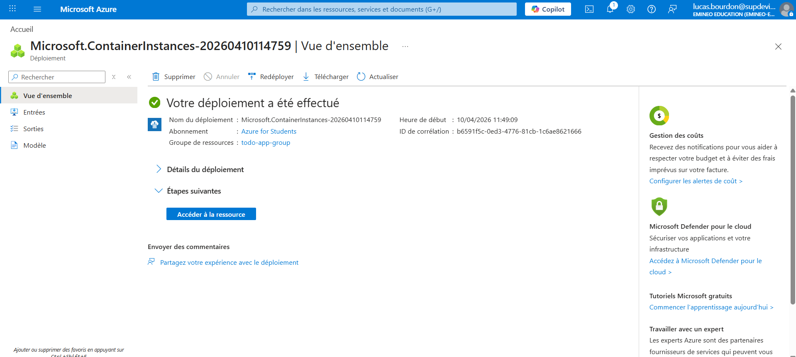

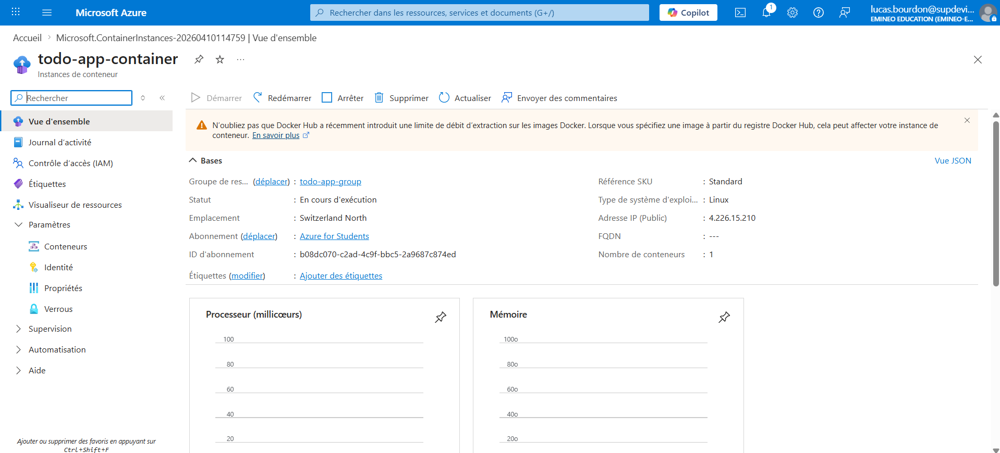

L'application est accessible via `http://<IP_PUBLIQUE>:3000`

---
